+++
title = "Time-fluid Field-based Coordination by Danilo Pianini"
outputs = ["Reveal"]

[reveal_hugo]
width = '90%'
height = '100%'
theme = "black"

+++



<script src="prism.js"></script>
<link rel="stylesheet" href="prism.css">
<link rel="stylesheet" href="blur.css">

# [Time-fluid field-based coordination](https://danysk.github.io/Slides-2020-Coordination-TimeFluid/)

__Danilo Pianini__, Stefano Mariani

Mirko Viroli, Franco Zambonelli

---



# What is time?

---



# Does time even exist?

---



# Between physics and philosophy

## *Pre-relativity*

* Immutable
* Everywhere
* Fine for many practical applications, but does not match reality

---



# Between physics and philosophy

## *Modern views*

* Very much related to the search for a unifying theory
* Several (conflicting) positions

**Suggested readings**

* Carroll's *From eternity to here*
* Rovelli's *The order of time*

---



# Relational interpretation
## Quantum systems are observer-dependent


> time might be meaningful only in presence of **_events_**

> time comes from **causality** and not vice versa

---



# Field based coordination

### Computing by evolving distributed data structures:
### *computational fields*

#### Notable examples (not exhaustive):

* **TOTA** (Mamei/Zambonelli)
* **Fixpoint-based computational fields** (Lafuente/Loreti/Montanari)
* **Aggregate computing** (Beal/Pianini/Viroli)

---

{}


# Field based coordination

## *Dealing with time*

* The designer focuses on the **eventual behaviour**
* Computation happens in **atomic rounds**
* Round scheduling is controlled **externally**
* Scheduling may be:
  * **reactive** e.g., in *TOTA*
  * **proactive**/**timed** e.g., in *Aggregate computing*
  * **abstracted away** e.g., in *Fixpoint-based computational fields*

---



# Field based coordination

## *Dealing with time in*
## **TOTA**

* Asynchronous
* Event-based
* Reactive to changes in network connectivity

---



# Field based coordination

## *Dealing with time in*
## **Fixpoint-based computational fields**

* Focus on "eventual behaviour"
* Mostly neglected / abstracted away

---



# Field based coordination

## *Dealing with time in*
## **Aggregate Computing**

* External, local proactive clock
* Loosely synchronous
  * Devices should run at a "similar" frequency

{}

---



# Field based coordination

## *Dealing with time*

* Historical focus on **space** rather than time
* Time is **abstracted away**  by design whenever possible

*...but in practice...*

* Space and time are **intertwined**
* **Propagation** speed influences the **evolution** of fields
* Dynamic systems are always in a **transient state**

---



# Challenge and desiderata

## *why bother?*

Fine grained control over **transient dynamics** \
enables improved **reactivity** to changes as well as **efficiency** \
both in *communication* and *energy consumption*

## *Requisites*

* **do not** force the designer to **lower** the **abstraction level**
* **do** support **all the existing** coordination mechanisms
* **do** allow for **proactive** and **reactive** policies 

---



# Time-Fluid Field Coordination

> leverage *field-based coordination itself* and maintain a **causality field** \
driving the dynamics of application-level fields

* Define a set of *platform triggers* (including *timers*) as event sources
* Associate a *guard policy* to every field program 
  * *inheriting the language* of the field program itself
* The guard policy domain is the **causality field**
* Allow results of *field computations* to *cause* other field computations
  * computation results are triggers themselves

---



# Time-Fluid Field Coordination

## Consequences

* From programming *space **in** time* to programming _**the** space-time_
  * Adaptation *controls* time rather than *experience* it
* **Adaptatation to causality** by reacting to perceived events
  * e.g., by *accelerating* or *slowing down* the field computation
* **Co-causality** as field computations can depend on each other
  * Of course, with great *expressiveness* comes great responsibility

---



# Time-Fluid Aggregate Computing

Prototype implementation [available](https://github.com/DanySK/Experiment-2020-Coordination-Time-Fluid-AC) using the [Protelis](http://www.protelis.org) programming language

* *No change* to the syntax of Protelis
* Aggregate computations have an associated *guard policy*
* Guard policies are written in *plain Protelis*

---



## Time-Fluid Aggregate Computing

*guard policy* code sample (more in the paper...)

```groovy
import platform.EventType.* // Event types are provided by the hosting platform
let reason = env.get("platform.event") // Sensor-like access to the triggering event
// Policy guards are full fledged aggregate programs
let peopleCount = foldSum(nbr(env.get("people_count")))
let attendantsChanged = rep(old <- -1) {
  if (old != peopleCount) { peopleCount } else { old }
} == peopleCount
[ // A policy returns a pair of:
  // A boolean, deciding whether the guarded program should run
  reason == MESSAGE_TIMEOUT || reason == MESSAGE_RECEIVED || rep(count <->),
  [MESSAGE_RECEIVED, SENSOR("people_count")] // A list of accepted future triggering events
]
```

---



### Evaluation

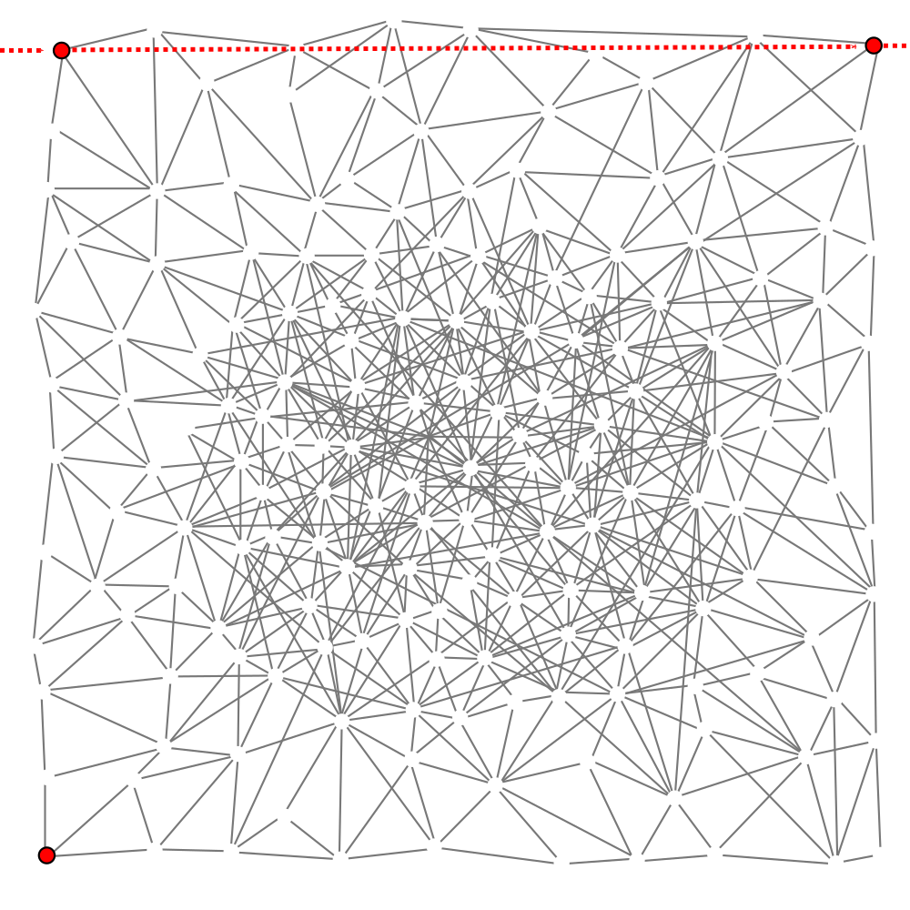

---



### Scenario

* 40x40 irregular grid of devices with the goal of computing *distance from* the closest *source*
* Sources are *mobile devices* and *one static* device located on South-West of the scenario
* Mobile devices enter one at a time from North-West and exit from North-East
* Devices *round frequency* is *dynamically* regulated via a *guard policy*

### Variables
* **f** --- maximum allowed frequency
* **v** --- speed of the mobile nodes

### Metrics
* **Error** --- Measured with respect to an oracle
* **Mean round count** --- Proxy metric for energy consumption


---



Yellow: less rounds, red: more rounds 1/10


---



Yellow: less rounds, red: more rounds 2/10


---



Yellow: less rounds, red: more rounds 3/10


---



Yellow: less rounds, red: more rounds 4/10


---



Yellow: less rounds, red: more rounds 5/10


---



Yellow: less rounds, red: more rounds 6/10


---



Yellow: less rounds, red: more rounds 7/10

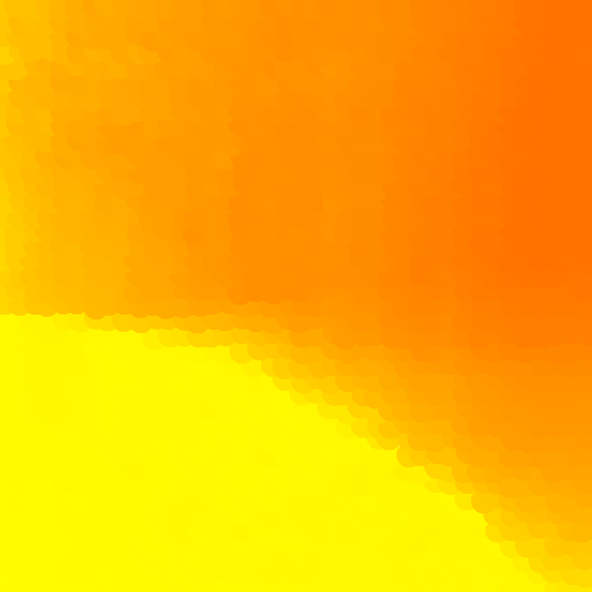

---



Yellow: less rounds, red: more rounds 8/10

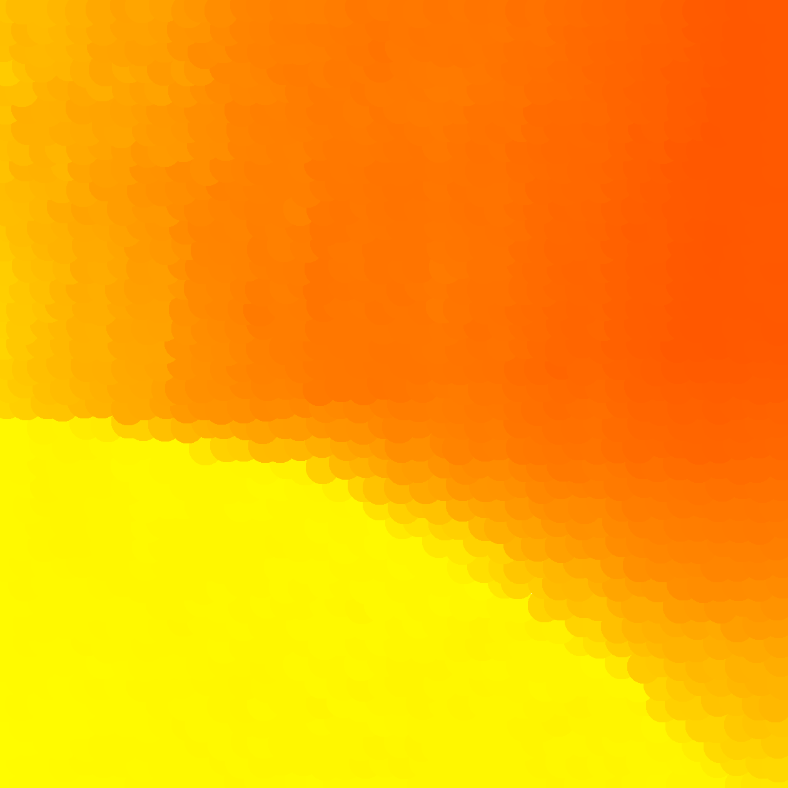

---



Yellow: less rounds, red: more rounds 9/10

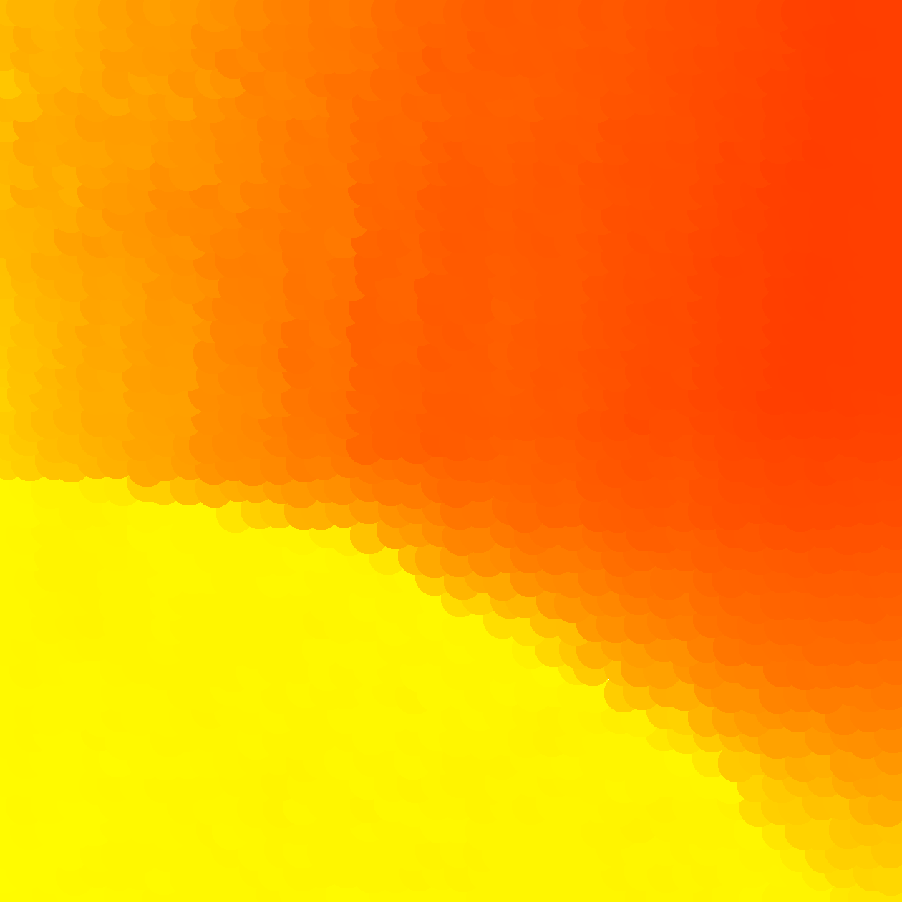

---



Yellow: less rounds, red: more rounds 10/10

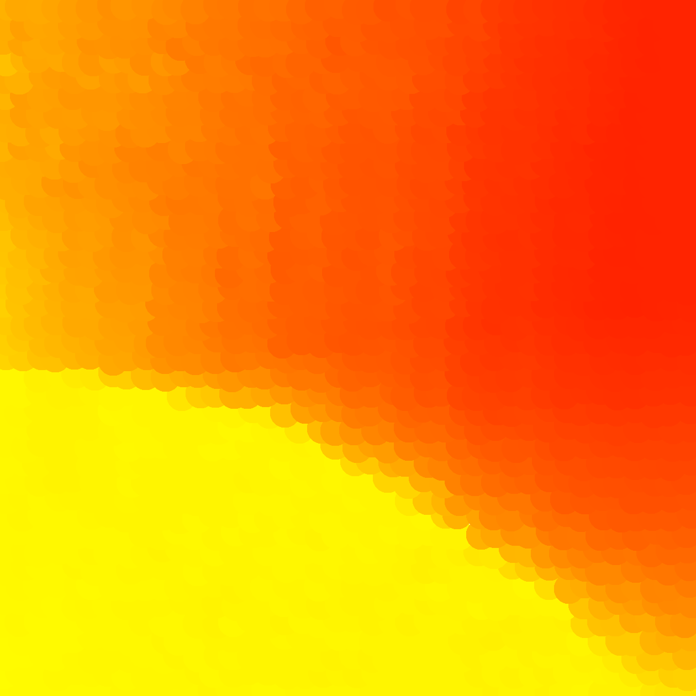


---



### Speed = 0

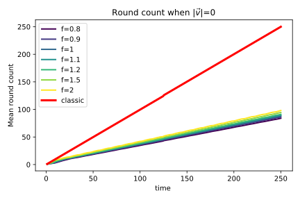
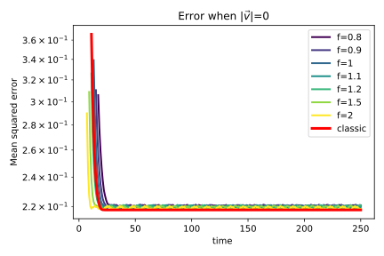

similar error, much lower energy cost

---



### Speed = 2

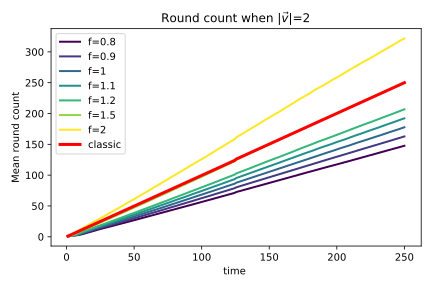
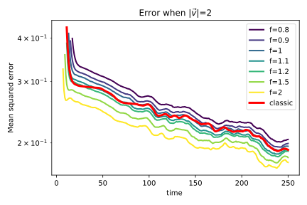

lower error *and* energy cost

---



### Speed = 5

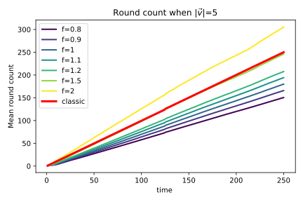
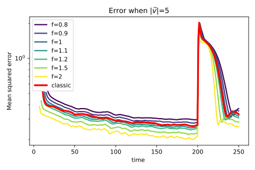

lower error *and* energy cost

---



### Speed = 10

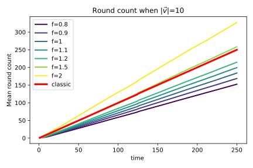
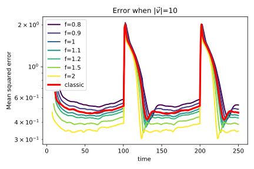

lower error *and* energy cost

---



# Time-Fluid Field Coordination

## Conclusion

* A **causality field** approach for programming **the** space-time
* Inherits the *host language*
* Applicable to *field-based coordination* approaches
* *Prototype available* for Aggregate Computing / Protelis

## Future work

* *Develop* the prototype to general availability 
* *Test* impact on real network